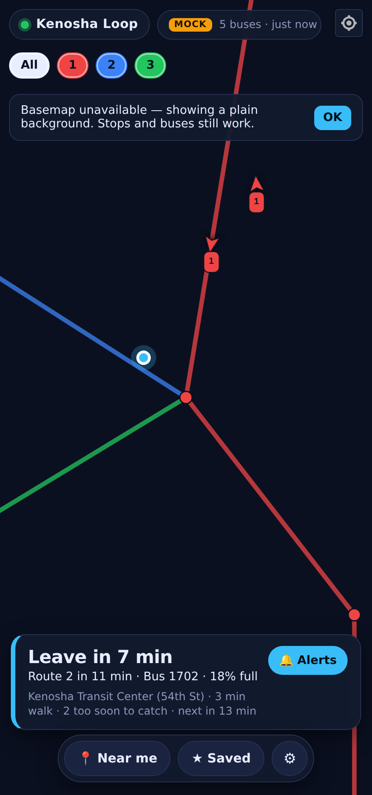
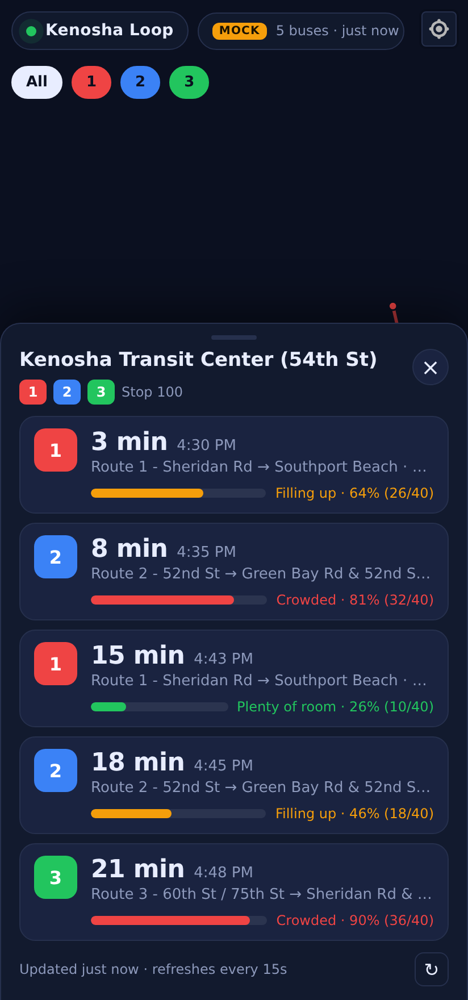
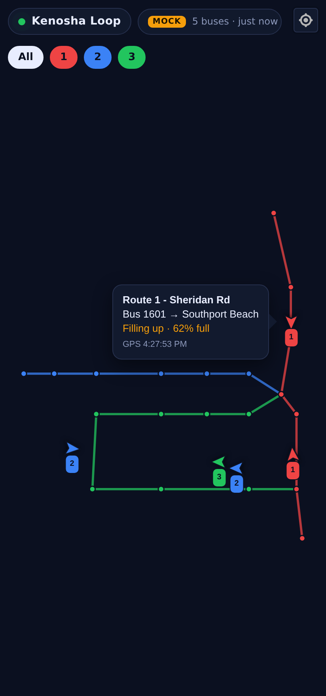

# Kenosha Transit Brain

A comprehensive, queryable knowledge base for Kenosha Transit that replaces hundreds of Google searches.

## Data Sources

1. **Official Schedule & Rules (2025 PDF)**
   - URL: https://www.kenosha.org/departments/transit/published_bus_schedules.php
   - Contains: Official bus schedules, routes, and service rules

2. **Bus Routes Map**
   - URL: https://www.kenosha.org/English%20Bus%20Routes.pdf
   - Contains: Visual route map and stop locations

3. **Fares**
   - URL: https://www.kenoshatransit.com/fares
   - Adult: $2.00
   - Student: $1.50

4. **Real-Time API (GMV Syncromatics)**
   - Vendor: GMV Syncromatics
   - Directory: https://gtfs-directory.syncromatics.com/
   - Provides: Real-time vehicle positions and trip updates

## Kenosha Loop (the app)

`frontend/` holds **Kenosha Loop**, a private one-user progressive web app: a dark MapLibre map
of Kenosha with live bus positions, a **Next Bus** bottom sheet showing minutes until each bus
reaches a tapped stop, and a **Crowd Meter** built from each bus's passenger-load percentage.

It also has a **Butler**. Turn a stop into a trip and the app stops answering "when does the bus
come" and starts answering the question you actually have: *when do I leave?* It counts down to
your leave time and buzzes the phone when it is time to go. Everything personal stays on the
device. Why it is built this way, and what gets built next, is in
[docs/DOCTRINE.md](docs/DOCTRINE.md).

```
Browser (Next.js app)  ──/api/vehicles/[routeId]──▶  Next.js API route  ──Chrome UA──▶  kenoshatransit.com/api/rtpi?path=routes/{id}/vehicles
                       ──/api/arrivals/[stopId]───▶  (same-origin, no CORS)          ▶  kenoshatransit.com/api/rtpi?path=stops/{id}/arrivals
                       ──/api/routes──────────────▶                                  ▶  kenoshatransit.com/ (route list in page data)
Upload UI (Flask :5000) ── drag & drop PDFs / GTFS ──▶ uploads/ ──▶ scripts/process_uploads.py ──▶ docs/knowledge_base.json
```

<p>
  
  
  
</p>

(Screenshots use the built-in mock data, `./scripts/dev.sh --mock`.)

Progress and known limits are tracked in [docs/MILESTONES.md](docs/MILESTONES.md).
To carry it on your phone with a permanent private URL, see [docs/DEPLOY_VERCEL.md](docs/DEPLOY_VERCEL.md).

Run everything with one command (see [docs/RUN_LOCAL.md](docs/RUN_LOCAL.md) for setup):

```bash
./scripts/dev.sh          # live data
./scripts/dev.sh --mock   # fake buses, works offline
./scripts/dev.sh --prod   # production build, installable as an app
```

## Structure

- `uploads/` - **Manual file uploads** (place source files here)
  - `schedules/` - Schedule PDFs
  - `maps/` - Route map PDFs
  - `gtfs/` - GTFS ZIP files
  - `api/` - API configuration JSON
- `data/` - Processed data files (auto-generated)
- `docs/` - Extracted documentation and knowledge base
- `scripts/` - Data fetching and processing scripts
- `query/` - Query interface and search tools
- `frontend/` - Kenosha Loop Next.js + MapLibre PWA (live map, Next Bus sheet, Crowd Meter)
- `templates/`, `static/` - Flask upload UI (every response is JSON, including errors)

## Quick Start

1. **Upload files**: Place PDFs/ZIPs in `uploads/` subdirectories
2. **Process**: Run `python scripts/process_uploads.py`
3. **Query**: Use `python query/cli.py "your question"`

## Usage

Query the knowledge base for instant answers about:
- Route schedules and stops
- Fares and pricing
- Real-time bus locations
- Service rules and policies
- Route maps and connections
